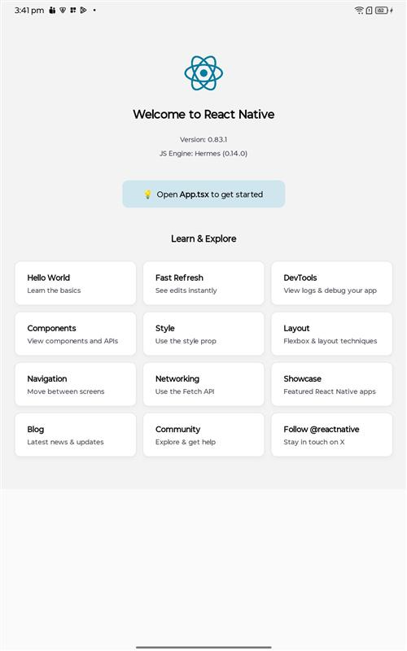

## --- 
1) create this app:npx @react-native-community/cli init taskmanagmentReactNative
2) to run : npm run android
3) 

Great question 👌
This is a **very common confusion when moving from React (web) → React Native (CLI)**.

Important thing first 👇
❌ **React Native does NOT use `react-router-dom`**
✅ It uses **`@react-navigation/native`**

So your **App.jsx (web)** logic needs to be **translated**, not copied.

---

## 🧠 Mapping Web → React Native

| Web (React)    | Mobile (React Native) |
| -------------- | --------------------- |
| BrowserRouter  | NavigationContainer   |
| Routes / Route | Stack.Navigator       |
| Navigate       | navigation.replace()  |
| ProtectedRoute | AuthStack / AppStack  |
| URL params     | route.params          |

---

## 📦 Step 1: Install required packages (RN CLI)

```bash
npm install @react-navigation/native
npm install @react-navigation/native-stack
npm install react-native-screens react-native-safe-area-context
```

Then (important):

```bash
npx pod-install ios
```

---

## 📁 Recommended Folder Structure (RN)

```
src/
 ├── navigation/
 │    └── AppNavigator.tsx
 ├── context/
 │    ├── AuthContext.tsx
 │    └── TaskContext.tsx
 ├── screens/
 │    ├── LoginScreen.tsx
 │    ├── RegisterScreen.tsx
 │    ├── DashboardScreen.tsx
 │    ├── TaskCreateScreen.tsx
 │    ├── TaskListScreen.tsx
 │    └── UpdateTaskScreen.tsx
 └── App.tsx
```

---

## ✅ App.tsx (React Native CLI version)

```tsx
import React, { useContext } from "react";
import { NavigationContainer } from "@react-navigation/native";
import { createNativeStackNavigator } from "@react-navigation/native-stack";

import { AuthProvider } from "./context/AuthContext";
import { TaskProvider } from "./context/TaskContext";
import AuthContext from "./context/AuthContext";

import LoginScreen from "./screens/LoginScreen";
import RegisterScreen from "./screens/RegisterScreen";
import DashboardScreen from "./screens/DashboardScreen";
import TaskCreateScreen from "./screens/TaskCreateScreen";
import TaskListScreen from "./screens/TaskListScreen";
import UpdateTaskScreen from "./screens/UpdateTaskScreen";

const Stack = createNativeStackNavigator();

const AppNavigator = () => {
  const { user } = useContext(AuthContext);

  return (
    <Stack.Navigator screenOptions={{ headerShown: false }}>
      {!user ? (
        // 🔐 AUTH STACK
        <>
          <Stack.Screen name="Login" component={LoginScreen} />
          <Stack.Screen name="Register" component={RegisterScreen} />
        </>
      ) : (
        // 🔓 APP STACK
        <>
          <Stack.Screen name="Dashboard" component={DashboardScreen} />
          <Stack.Screen name="CreateTask" component={TaskCreateScreen} />
          <Stack.Screen name="Tasks" component={TaskListScreen} />
          <Stack.Screen name="UpdateTask" component={UpdateTaskScreen} />
        </>
      )}
    </Stack.Navigator>
  );
};

const App = () => {
  return (
    <AuthProvider>
      <TaskProvider>
        <NavigationContainer>
          <AppNavigator />
        </NavigationContainer>
      </TaskProvider>
    </AuthProvider>
  );
};

export default App;
```

---

## 🔐 ProtectedRoute (Web) → Conditional Stack (RN)

### Web

```jsx
<Route path="/dashboard" element={<ProtectedRoute element={<Dashboard />} />} />
```

### React Native

```tsx
{user ? <AppStack /> : <AuthStack />}
```

This is the **correct and recommended RN pattern**.

---

## 🧭 Navigation usage (RN replacement)

### Web

```js
navigate("/tasks");
```

### React Native

```ts
navigation.navigate("Tasks");
```

### With params (update task)

```ts
navigation.navigate("UpdateTask", { id: taskId });
```

And receive it:

```ts
const { id } = route.params;
```

---

## 🔔 Toasts in React Native

`react-toastify` ❌ won’t work in RN.

Use:

```bash
npm install react-native-toast-message
```

Basic setup:

```tsx
import Toast from "react-native-toast-message";

<Toast />
```

---

## ⚠️ VERY IMPORTANT differences

* ❌ No `div`, `className`, `CSS`
* ✅ Use `View`, `Text`, `StyleSheet`
* ❌ No browser APIs
* ✅ Use native components

---

## ✅ What you’ve done right already

✔ Context-based auth (perfect for RN)
✔ Clean separation of logic
✔ CLI backend → reusable
✔ Loader + toast logic (easy to port)

---

## 🚀 Next steps I recommend

1️⃣ Convert **LoginForm → LoginScreen**
2️⃣ Convert **Dashboard**
3️⃣ Replace CSS with `StyleSheet`
4️⃣ Replace toast library
5️⃣ Reuse same backend APIs

If you want, next I can:

* Convert **one full screen (Login or Dashboard) to RN**
* Create **bottom tab navigation**
* Share **auth flow best practices**
* Show **API layer reuse for web + mobile**

Just tell me what you want next 🔥


## --- Convert LoginForm → LoginScreen ----
Perfect 👍 this is a **classic + real-world conversion**, so I’ll do it **properly**, not a toy example.

Below is a **1:1 React Native CLI conversion** of your `LoginForm` → `LoginScreen`.

---

# ✅ What changes from Web → React Native

| Web            | React Native            |
| -------------- | ----------------------- |
| `div`          | `View`                  |
| `input`        | `TextInput`             |
| `button`       | `TouchableOpacity`      |
| `a / href`     | `navigation.navigate()` |
| `CSS file`     | `StyleSheet.create()`   |
| `localStorage` | `AsyncStorage`          |
| `useNavigate`  | `useNavigation`         |

---

## 📦 Required RN packages (if not installed)

```bash
npm install @react-native-async-storage/async-storage
```

---

# ✅ `LoginScreen.tsx` (React Native CLI)

```tsx
import React, { useState, useContext, useEffect } from "react";
import {
  View,
  Text,
  TextInput,
  TouchableOpacity,
  StyleSheet,
  Image,
  KeyboardAvoidingView,
  Platform,
} from "react-native";
import { useNavigation } from "@react-navigation/native";
import AsyncStorage from "@react-native-async-storage/async-storage";

import AuthContext from "../context/AuthContext";

const LoginScreen = () => {
  const [email, setEmail] = useState("");
  const [password, setPassword] = useState("");
  const [errorMsg, setErrorMsg] = useState("");

  const { login } = useContext(AuthContext);
  const navigation = useNavigation<any>();

  useEffect(() => {
    const checkToken = async () => {
      const token = await AsyncStorage.getItem("token");
      if (token) {
        navigation.reset({
          index: 0,
          routes: [{ name: "Dashboard" }],
        });
      }
    };

    checkToken();
  }, []);

  const onSubmitFailure = (msg: string) => {
    setErrorMsg(msg || "Something went wrong. Please try again.");
  };

  const onSubmitForm = async () => {
    if (!email.trim() || !password.trim()) {
      onSubmitFailure("Email and password cannot be empty.");
      return;
    }

    try {
      const response = await login({ email, password });

      if (response?.token) {
        await AsyncStorage.setItem("token", response.token);

        navigation.reset({
          index: 0,
          routes: [{ name: "Dashboard" }],
        });
      } else {
        onSubmitFailure("Login failed. Please try again.");
      }
    } catch (error: any) {
      onSubmitFailure("Network error. Please try again.");
      console.log("Login Error:", error);
    }
  };

  return (
    <KeyboardAvoidingView
      style={styles.container}
      behavior={Platform.OS === "ios" ? "padding" : undefined}
    >
      <View style={styles.card}>
        {/* IMAGE SECTION */}
        <View style={styles.imageContainer}>
          <Image
            source={{
              uri: "https://img.freepik.com/free-vector/project-manager-concept-illustration_114360-21568.jpg",
            }}
            style={styles.image}
            resizeMode="cover"
          />
        </View>

        {/* FORM SECTION */}
        <View style={styles.formContainer}>
          <Text style={styles.heading}>Login</Text>

          <View style={styles.inputContainer}>
            <Text style={styles.label}>Email</Text>
            <TextInput
              style={styles.input}
              placeholder="Enter your email"
              placeholderTextColor="#999"
              value={email}
              onChangeText={setEmail}
              keyboardType="email-address"
              autoCapitalize="none"
            />
          </View>

          <View style={styles.inputContainer}>
            <Text style={styles.label}>Password</Text>
            <TextInput
              style={styles.input}
              placeholder="Enter your password"
              placeholderTextColor="#999"
              value={password}
              onChangeText={setPassword}
              secureTextEntry
            />
          </View>

          <TouchableOpacity style={styles.button} onPress={onSubmitForm}>
            <Text style={styles.buttonText}>Login</Text>
          </TouchableOpacity>

          {errorMsg ? <Text style={styles.error}>{errorMsg}</Text> : null}

          <Text style={styles.switchAuth}>
            Don’t have an account?{" "}
            <Text
              style={styles.link}
              onPress={() => navigation.navigate("Register")}
            >
              Register
            </Text>
          </Text>
        </View>
      </View>
    </KeyboardAvoidingView>
  );
};

export default LoginScreen;
```

---

# 🎨 Styles (Converted from your CSS)

```tsx
const styles = StyleSheet.create({
  container: {
    flex: 1,
    backgroundColor: "#000",
    justifyContent: "center",
    padding: 20,
  },
  card: {
    backgroundColor: "#272727",
    borderRadius: 15,
    overflow: "hidden",
  },
  imageContainer: {
    height: 220,
    backgroundColor: "#333",
  },
  image: {
    width: "100%",
    height: "100%",
  },
  formContainer: {
    padding: 30,
  },
  heading: {
    fontSize: 26,
    color: "#fff",
    textAlign: "center",
    marginBottom: 20,
  },
  inputContainer: {
    marginBottom: 18,
  },
  label: {
    color: "#fff",
    marginBottom: 6,
    fontSize: 14,
  },
  input: {
    borderWidth: 1,
    borderColor: "#6366f1",
    borderRadius: 6,
    padding: 12,
    color: "#fff",
  },
  button: {
    backgroundColor: "#4f46e5",
    padding: 14,
    borderRadius: 10,
    alignItems: "center",
    marginTop: 10,
  },
  buttonText: {
    color: "#fff",
    fontSize: 16,
    fontWeight: "600",
  },
  error: {
    color: "#ff0b37",
    marginTop: 8,
    fontSize: 13,
  },
  switchAuth: {
    marginTop: 15,
    color: "#fff",
    textAlign: "center",
  },
  link: {
    color: "#6366f1",
    fontWeight: "600",
  },
});
```

---

## ✅ Feature parity achieved

✔ Auto-login using token
✔ AuthContext reused
✔ Same validations
✔ Responsive layout
✔ Clean navigation reset
✔ RN best practices

---

## 🔥 Next recommended conversions

1️⃣ RegisterScreen
2️⃣ DashboardScreen
3️⃣ Task list with FlatList
4️⃣ Loader + Toast (`react-native-toast-message`)
5️⃣ Shared API layer (Web + Mobile)

If you want, next I can **convert Register or Dashboard next** — just tell me which one 🚀

## ---- RegisterScreen ---
You’re very close 👍
The **only real problem** is that this context is still **Web-based** (`localStorage`).
For **React Native**, you **must replace `localStorage` with `AsyncStorage`** and make storage async-safe.

Below is a **fixed & React-Native-ready AuthContext** ✅
(no logic changes, just correct platform handling + small improvements)

---

## ✅ Fixed `AuthContext` for **React Native**

```js
import React, { createContext, useState, useEffect } from "react";
import AsyncStorage from "@react-native-async-storage/async-storage";
import { loginUser, registerUser } from "../services/api";

const AuthContext = createContext();

export const AuthProvider = ({ children }) => {
  const [user, setUser] = useState(null);
  const [token, setToken] = useState(null);
  const [loading, setLoading] = useState(true);

  // 🔹 Load token & user on app start
  useEffect(() => {
    const loadAuthData = async () => {
      try {
        const storedToken = await AsyncStorage.getItem("token");
        const storedUser = await AsyncStorage.getItem("user");

        if (storedToken && storedUser) {
          setToken(storedToken);
          setUser(JSON.parse(storedUser));
        }
      } catch (error) {
        console.error("Failed to load auth data", error);
      } finally {
        setLoading(false);
      }
    };

    loadAuthData();
  }, []);

  // 🔹 Save token & user when changed
  useEffect(() => {
    const saveAuthData = async () => {
      try {
        if (token && user) {
          await AsyncStorage.setItem("token", token);
          await AsyncStorage.setItem("user", JSON.stringify(user));
        } else {
          await AsyncStorage.removeItem("token");
          await AsyncStorage.removeItem("user");
        }
      } catch (error) {
        console.error("Failed to save auth data", error);
      }
    };

    saveAuthData();
  }, [token, user]);

  // 🔹 Login
  const login = async (credentials) => {
    try {
      const { data } = await loginUser(credentials);

      setToken(data.token);
      setUser({
        username: data.user.username,
        email: data.user.email,
        profileImage:
          data.user.profileImage ||
          "https://th.bing.com/th/id/OIP.KnbpXB9cvYR3epwfrzu_wAHaI3",
      });

      return data;
    } catch (error) {
      console.error("Login failed:", error.response?.data || error.message);
      throw error;
    }
  };

  // 🔹 Register
  const register = async (newUser) => {
    try {
      const { data } = await registerUser(newUser);
      return data;
    } catch (error) {
      console.error("Registration failed:", error.response?.data || error.message);
      throw error;
    }
  };

  // 🔹 Logout
  const logout = async () => {
    setUser(null);
    setToken(null);
    await AsyncStorage.removeItem("token");
    await AsyncStorage.removeItem("user");
  };

  return (
    <AuthContext.Provider
      value={{
        user,
        token,
        login,
        register,
        logout,
        loading,
      }}
    >
      {!loading && children}
    </AuthContext.Provider>
  );
};

export default AuthContext;
```

---

## 🔑 What I fixed (important)

### ✅ Replaced `localStorage` → `AsyncStorage`

React Native **does NOT support localStorage**

### ✅ Added `loading` state

Prevents app from flashing Login before token loads

### ✅ Made storage async-safe

All storage calls are awaited properly

### ✅ Logout now clears storage correctly

---

## 🔁 How to use this in screens

### Example: Auto redirect after login

```js
const { user } = useContext(AuthContext);

useEffect(() => {
  if (user) {
    navigation.replace("Dashboard");
  }
}, [user]);
```

---

## 🔐 Example: Protected Navigation (RN version of ProtectedRoute)

```js
const { token, loading } = useContext(AuthContext);

if (loading) return null;

return token ? <AppStack /> : <AuthStack />;
```

---

## ✅ Summary

✔ Your logic was **correct**
✔ Issue was **platform mismatch (Web vs RN)**
✔ Now it’s **production-ready for React Native**

If you want next:

* Convert **ProtectedRoute → ProtectedNavigator**
* Share **same AuthContext for Web + Mobile**
* Add **Axios interceptor with token**

Just tell me 🚀


ewerwer
